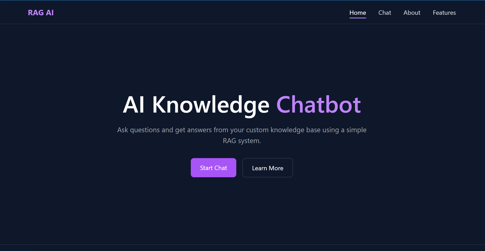
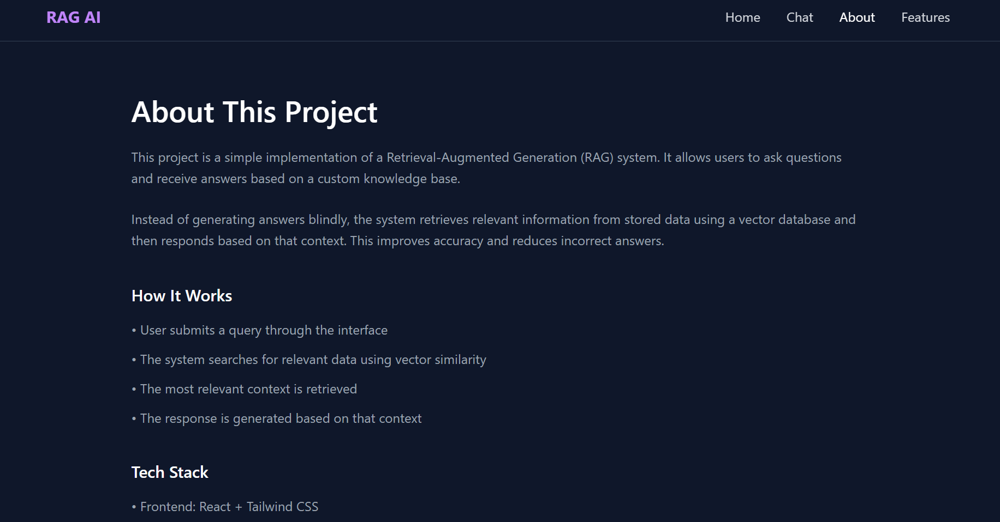
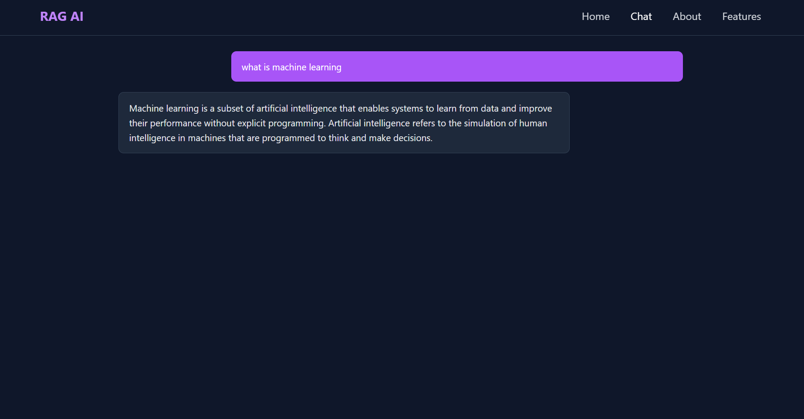

# rag-ai
# 🚀 RAG AI

### AI-Powered Retrieval System with Full-Stack Implementation

---

## 🌟 Overview

**RAG AI** is an AI-focused application that demonstrates a **Retrieval-Augmented Generation (RAG)** pipeline using vector embeddings and semantic search, integrated into a full-stack system.

The project allows users to query a custom knowledge base using natural language. Instead of traditional keyword matching, it uses **embedding-based similarity search** to retrieve relevant information.

While the system includes a complete frontend and backend, the primary focus is on **AI/ML concepts**, including:
- vector representations of text  
- semantic similarity search  
- retrieval-based reasoning  

The full-stack layer (React + FastAPI) enables real-time interaction with the AI system.

---

## 🎯 Key Features

* 🔍 **Semantic Search (AI Core)**
  Retrieves information based on meaning using vector embeddings.

* 🧠 **RAG Pipeline Implementation**
  Demonstrates retrieval-based architecture used in modern AI systems.

* 📄 **Custom Knowledge Base**
  Uses `data.txt` to simulate real-world document retrieval.

* ⚡ **FastAPI Backend**
  Handles API requests and integrates with the vector database.

* 💬 **Interactive Frontend**
  Built with React + Tailwind for real-time query interaction.

* 🔎 **Transparent Retrieval**
  Returns the exact context used for answering.

---

## 🏗️ System Architecture
User Query
↓
Text Embedding (ChromaDB)
↓
Vector Similarity Search
↓
Top Relevant Chunk
↓
Returned as Response

---

## 🧠 How It Works

1. Data is loaded from `data.txt`
2. Text is split into meaningful chunks
3. Each chunk is converted into vector embeddings
4. Embeddings are stored in ChromaDB
5. User query is converted into a vector
6. System retrieves the most relevant chunk
7. Retrieved content is returned as the answer

👉 This demonstrates the **retrieval component of RAG systems**, widely used in modern AI applications.

---

## ⚙️ Tech Stack

| Layer       | Technology        |
|------------|-----------------|
| AI/ML Core | ChromaDB (Vector Search) |
| Backend    | FastAPI          |
| Frontend   | React + Tailwind |
| Language   | Python, JavaScript |

---

## 🚀 Installation & Setup

### 1. Clone Repository

``bash
git clone https://github.com/sivabadeti/rag-ai.git
cd rag-ai

2. Backend
   
   cd rag-backend
   
   pip install fastapi uvicorn chromadb
   
   uvicorn main:app --reload
   
3.Frontend

  cd rag-frontend/react
  
  npm install
  
  npm run dev

⚠️ Note on Endee / Vector Databases

   This project is based on the concept of vector databases used in modern RAG systems (such as Endee).

  Due to environment and access limitations, ChromaDB is used as a local vector database to implement the same core 
principles:

  - storing embeddings
    
  - performing similarity search
    
  - retrieving relevant context  
  
  This allows the system to demonstrate real-world retrieval workflows while remaining lightweight and easy to run locally.

## 📸 Demo
# Home

# Chatbox

# About

# Output

## 👨‍💻 Author

**Siva Badeti**

- GitHub: https://github.com/sivabadeti
- LinkedIn: https://www.linkedin.com/in/sivabadeti-25b35534b
- Email: sivabadeti2005@gmail.com
